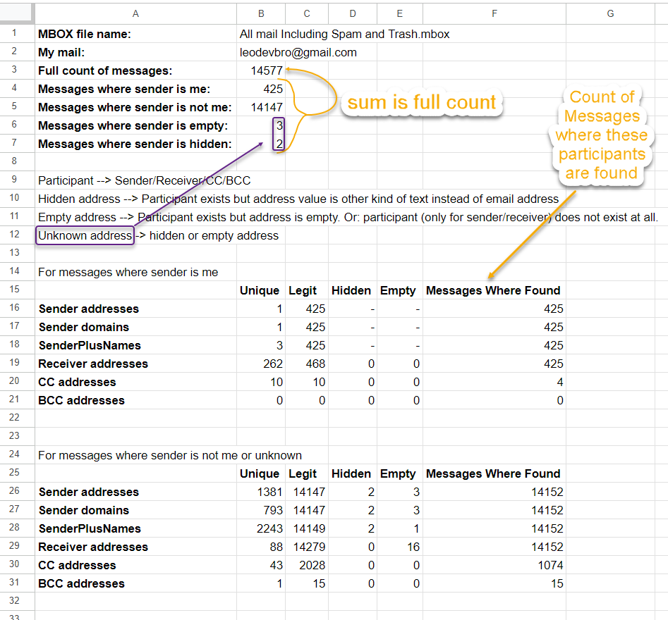

# gmail-mbox-stats

[](https://www.npmjs.com/package/gmail-mbox-stats)
[](https://github.com/leodevbro/gmail-mbox-stats)

`gmail-mbox-stats` is a very simple tool to analyze your Gmail mailbox.

- Find the sender which sent most mails.
- Find the receiver where you sent most mails.
  <br />
  <br />
- Find the domain (@gmail.com, @live.com ...) which appears mostly in sender address.
- Find the receiver where other senders (where sender is not you) sent most mails.
  <br />
  <br />
- Find the address which is most often placed in CC by you.
- Find the address which is most often placed in CC by others.
  <br />
  <br />
- Find the address which is most often placed in BCC by you.
- Find the address which is most often placed in BCC by others.
  <br />
  <br />
- And more.
  <br />
  <br />
  <br />

## Video instruction:

Coming soon...

<br />
<br />

## Textual instruction:

- Download Gmail data from <a href="https://takeout.google.com/" target="_blank">Google Takeout</a> (Preferably select 'Include all messages in Mail', it will include all mail, not just Inbox or just Sent/Spam/Archive/Trash). If your mailbox has 100K mails, the downloaded data can be 10 GB or more. So, be ready to deal with a large file. If it is too large, it may not be a single archive file, but multipart archive files, like split-files of ZIP.

- Extract MBOX file from the Gmail data file(s).

- Make sure you have installed <a href="https://nodejs.org/" target="_blank">NodeJS</a>. It is available for Windows, Mac and also Linux.

- Open terminal (preferably in the same folder where MBOX file is located) - in Windows/Mac/Linux. For Windows, the terminal should be PowerShell, not CMD.

- run a command with this syntax:<br />
  `npx gmail-mbox-stats mymail="<your email address>" mboxpath="<mbox file path>"`

  for example:<br />
  `npx gmail-mbox-stats mymail="leodevbro@gmail.com" mboxpath="./All mail Including Spam and Trash.mbox"`<br />
  the notation `./` means to find the file `All mail Including Spam and Trash.mbox` in the current folder of the terminal.

<br />
<br />
<br />
<br />
<br />
<br />
<br />
<br />
That's it.<br />
Now just see the results:
<br />
<br />
<br />
<br />
<br />
<br />
<br />
<br />
<br />

It will take probably 5-10-15 seconds to analyze 1000 mails (messages),<br />
about 100 seconds for 10K mails,<br />
about 1000 seconds (10-15-20 minutes) for 100K mails and so on.<br />

- When it finishes, the terminal will log initial information like this:

```
Success.
Full count of messages: 14577
Messages where sender is me: 425
Messages where sender is not me: 14152
Messages where sender is hidden: 0
Messages where sender is empty: 0


Start datetime: 3/30/2024, 5:21:29 PM
->End datetime: 3/30/2024, 5:23:02 PM

Full Execution Time: 1:33.267 (m:ss.mmm)


gmail-mbox-stats v1.0.8
Created by leodevbro (Levan Katsadze)
* linkedin.com/in/leodevbro
* github.com/leodevbro
* facebook.com/leodevbro

If you feel like donating
* buymeacoffee.com/leodevbro
* ko-fi.com/leodevbro
```

- Also, there will be a new folder named "mailStats" with current local datetime, <br />
  like this: `mailStats_2024-03-14_16-52-06`<br />
  in the same folder where the MBOX file is located.<br />

- In the 'mailStats' folder, there will be `generalStats.csv` file. If you import it in Google Sheets it will like this:

<br />



<br />

- In the 'mailStats' folder, there will be also two folders:<br />
  `forMailsWhereSenderIsMe` - the stats for only the mails where sender is you.<br />
  `forMailsWhereSenderIsNotMeOrIsUnknown` - the stats for only the mails where sender is not you, or sender is unknown.<br />
  In both folders, there will be `.csv` files of stats. You can import them one by one in Google Sheets.

Here is what the full folder structure looks like:

```
▨All mail Including Spam and Trash.mbox

📂mailStats_2024-03-14_16-52-06
    ▦generalStats.csv

    📂forMailsWhereSenderIsMe
        ▦me_freqBcc.csv
        ▦me_FreqCc.csv
        ▦me_FreqReceiver.csv --- Here you can find the receiver where you sent most mails
        ▦me_FreqSender.csv
        ▦me_freqSenderDomain.csv
        ▦me_freqSenderPlusName.csv

    📂forMailsWhereSenderIsNotMeOrIsUnknown
        ▦notMeOrUnkn_freqBcc.csv
        ▦notMeOrUnkn_FreqCc.csv
        ▦notMeOrUnkn_FreqReceiver.csv
        ▦notMeOrUnkn_FreqSender.csv --- Here you can find the sender which sent most mails
        ▦notMeOrUnkn_freqSenderDomain.csv
        ▦notMeOrUnkn_freqSenderPlusName.csv

```

<br />

Now, for example, let's import the file `notMeOrUnkn_freqSender.csv` in Google Sheets:
<br />


Also, let's import the file `notMeOrUnkn_freqReceiver.csv` in Google Sheets:
<br />


(README not yet completed, to do soon...)
<br />
<br />
Thank you.

<p>My name is <a href="https://leodevbro.github.io">Levan Katsadze (ლევან კაცაძე)</a>, 1995-03-03, from Tbilisi, <a href="https://en.wikipedia.org/wiki/Georgia_(country)">Georgia (Not USA)</a>.</p>

<p float="left">
  <a style="margin-right: 12px;" href="https://www.facebook.com/leodevbropage" target="_blank"></a>
  <a style="margin-right: 12px;" href="https://www.youtube.com/@leodevbro" target="_blank"></a>
</p>

If you feel like donating:

<p float="left">
  <a style="float: left; margin-right: 12px;" href="https://www.buymeacoffee.com/leodevbro" target="_blank"></a>
  <a style="margin-right: 12px;" href="https://ko-fi.com/leodevbro" target="_blank"></a>
</p>

<br />
<br />
<br />
